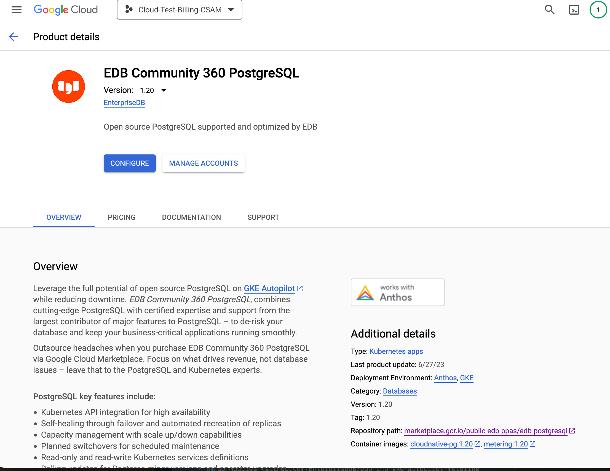
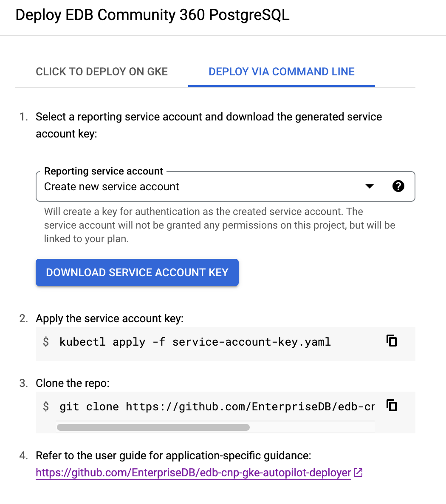

# Overview

EDB Community 360 PostgreSQL is built on an open source operator designed to manage PostgreSQL workloads on 
any supported Kubernetes cluster running in private, public, hybrid, or multi-cloud environments. EDB Community 
360 PostgreSQL adheres to DevOps principles and concepts such as declarative configuration and immutable infrastructure.

For more information, visit the
[CloudNativePG official website](https://cloudnative-pg.io/).

# Installation

## Quick install with Google Cloud Marketplace

Get up and running with a few clicks! Install this EDB Community 360 PostgreSQL app to a
Google Kubernetes Engine cluster using Google Cloud Marketplace. Follow the
[on-screen instructions](https://console.cloud.google.com/marketplace/details/public-edb-ppas/edb-postgresql).

## Manual installation instructions

### Prerequisites

#### Set up command-line tools

You'll need the following tools in your development environment. If you are
using Cloud Shell, then `gcloud`, `kubectl`, Docker, and Git are installed in
your environment by default.

- [gcloud](https://cloud.google.com/sdk/gcloud/)
- [kubectl](https://kubernetes.io/docs/reference/kubectl/overview/)
- [docker](https://docs.docker.com/install/)
- [git](https://git-scm.com/book/en/v2/Getting-Started-Installing-Git)
- [helm](https://helm.sh/)
- [envsubst](https://command-not-found.com/envsubst)

Configure `gcloud` as a Docker credential helper:

```shell
gcloud auth configure-docker
```


### Obtain license key from Google Cloud Marketplace
This license key is a Google Marketplace License that enables the pay as you go billing integration into your account.

#### Purchase EDB Community 360 PostgreSQL on Google Kubernetes Engine via the GCP Marketplace in a GCP project

See the following screenshot for an example



#### Generate a service account key for the GCP project for billing

Click the “Download Service Account Key” button to generate the license key.  It will automatically be downloaded onto your computer.



Save the servicea account key file preferably as `service-account-key.yaml`.

#### Create a Google Kubernetes Engine (GKE) cluster

Create a new cluster from the command line:

```shell
export CLUSTER=edb-community-360-cluster
export ZONE=us-west1-a

gcloud container clusters create "${CLUSTER}" --zone "${ZONE}"
```

Configure `kubectl` to connect to the new cluster:

```shell
gcloud container clusters get-credentials "${CLUSTER}" --zone "${ZONE}"
```

#### Clone this repo

Clone this repo and its associated tools repo:

```shell
git clone --recursive https://github.com/EnterpriseDB/edb-cnpg-gke-autopilot-deployer.git
```

#### Install the Application resource definition

An Application resource is a collection of individual Kubernetes components,
such as Services, Deployments, and so on, that you can manage as a group.

To set up your cluster to understand Application resources, run the following command:

```shell
kubectl apply -f "https://raw.githubusercontent.com/GoogleCloudPlatform/marketplace-k8s-app-tools/master/crd/app-crd.yaml"
```

You need to run this command once.

The Application resource is defined by the
[Kubernetes SIG-apps](https://github.com/kubernetes/community/tree/master/sig-apps) community.
The source code can be found on [github.com/kubernetes-sigs/application](https://github.com/kubernetes-sigs/application).

### Install the app

Navigate to the `edb-cnpg-gke-autopilot-deployer` directory:

```shell
cd edb-cnpg-gke-autopilot-deployer
```

#### Configure the app with environment variables

Choose an instance name and
[namespace](https://kubernetes.io/docs/concepts/overview/working-with-objects/namespaces/)
for the app. By convention, EDB Community 360 PostgreSQL uses the `cnpg-system` namespace, but in most cases, you can use the 
`default` namespace.

```shell
export APP_INSTANCE_NAME=edb-gke-cnpg-autopilot
export NAMESPACE=cnpg-system
```

#### Create namespace in your Kubernetes cluster

If you use a different namespace than the `default`, run the command below to create a new namespace:

```shell
kubectl create namespace "${NAMESPACE}"
```

#### Prepare and install the service account key

Ensure that the service account key you downloaded earlier is in your current working directly and is named `service-account-key.yaml`.

Prepare the service account key by giving it the specific `metadata.name` below based on the application instance name you 
defined earlier.

```bash
sed -i "s/name:.*/name: $APP_INSTANCE_NAME-reportingsecret/" service-account-key.yaml
```

Install the service account key onto the Kubernetes cluster.

```bash
kubectl apply -n $NAMESPACE -f service-account-key.yaml
```

#### Set up the image tag:

It is advised to use stable image reference which you can find on
[Marketplace Container Registry](https://marketplace.gcr.io/public-edb-ppas/edb-postgresql).

Example:

```shell
export TAG="1.20.0-<BUILD_ID>"
```

Alternatively you can use short tag which points to the latest image for selected version.
> Warning: this tag is not stable and referenced image might change over time.

```shell
export TAG="1.20"
```

Configure the container image. Note that `IMAGE_OPERATOR` does not include the TAG in the variable.

```shell
export IMAGE_OPERATOR="marketplace.gcr.io/public-edb-ppas/edb-postgresql/cloudnative-pg"
export IMAGE_METERING="marketplace.gcr.io/public-edb-ppas/edb-postgresql/metering:${TAG}"
```

##### Create dedicated Service Accounts

Define the environment variables:

```shell
export OPERATOR_SERVICE_ACCOUNT="${APP_INSTANCE_NAME}-cnpg"
export METERING_SERVICE_ACCOUNT="${APP_INSTANCE_NAME}-cnpg-metering"
```

Expand the manifest to create Service Accounts:

```shell
cat resources/service-accounts.yaml \
  | envsubst '${APP_INSTANCE_NAME} \
              ${NAMESPACE} \
              ${OPERATOR_SERVICE_ACCOUNT} \
              ${METERING_SERVICE_ACCOUNT}' \
    > "${APP_INSTANCE_NAME}_sa_manifest.yaml"
```

Create the accounts on the cluster with `kubectl`:

```shell
kubectl apply -f "${APP_INSTANCE_NAME}_sa_manifest.yaml" \
    --namespace "${NAMESPACE}"
```

#### Pull in CloudNativePG Helm Chart

Ensure that the `TAG` environment variable is still set when running the following command.

```shell
make update-chart
```

#### Expand the manifest template

Use `helm template` to expand the template. We recommend that you save the
expanded manifest file for future updates to the app.

```shell
helm template "${APP_INSTANCE_NAME}" chart/edb-cnpg-gke-autopilot\
  --namespace "${NAMESPACE}" \
  --set cloudnative-pg.image.repository="${IMAGE_OPERATOR}" \
  --set cloudnative-pg.image.tag="${TAG}" \
  --set cloudnative-pg.serviceAccount.name=${OPERATOR_SERVICE_ACCOUNT} \
  --set metering.serviceAccountName=${METERING_SERVICE_ACCOUNT} \
  --set metering.reportingSecret=${APP_INSTANCE_NAME}-reportingsecret \
  --set metering.image.image="${IMAGE_METERING}" \
  > "${APP_INSTANCE_NAME}_manifest.yaml"
```

#### Apply the manifest to your Kubernetes cluster

Use `kubectl` to apply the manifest to your Kubernetes cluster:

```shell
kubectl apply -f "${APP_INSTANCE_NAME}_manifest.yaml" --namespace "${NAMESPACE}"
```

#### View the app in the Google Cloud Console

To get the GCP Console URL for your app, run the following command:

```shell
echo "https://console.cloud.google.com/kubernetes/application/${ZONE}/${CLUSTER}/${NAMESPACE}/${APP_INSTANCE_NAME}"
```

To view the app, open the URL in your browser.

# Using the app

Once the operator is up and running, you can follow the [CloudNativePG documentation](https://cloudnative-pg.io/docs/) 
to get started creating instances. You can find all information to begin creating and managing clusters on the
documentation site.

# Scaling
See: [Resource Management](https://cloudnative-pg.io/documentation/current/resource_management/)

# Backup and restore
See: [Backup and Recovery](https://cloudnative-pg.io/documentation/current/backup_recovery/)

# Updating
See: [Installation and Upgrades](https://cloudnative-pg.io/documentation/current/installation_upgrade/)

# Deleting your PostgreSQL installation

Deleting the `Cluster` CRD will delete all resources for the particular instance.

# Deleting the operator

Deleting the `Application` CRD with the `APP_INSTANCE_NAME` you installed the operator with will clean up 
the operator resources. You may also delete the service accounts and license secret that you created when installing.
